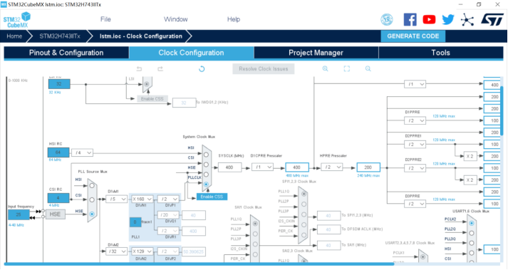
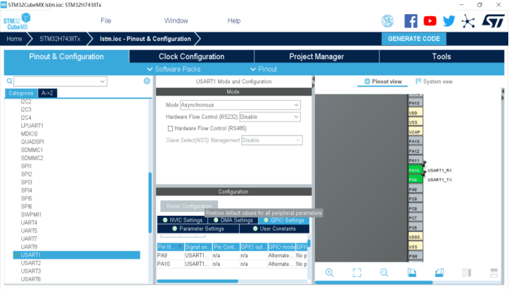
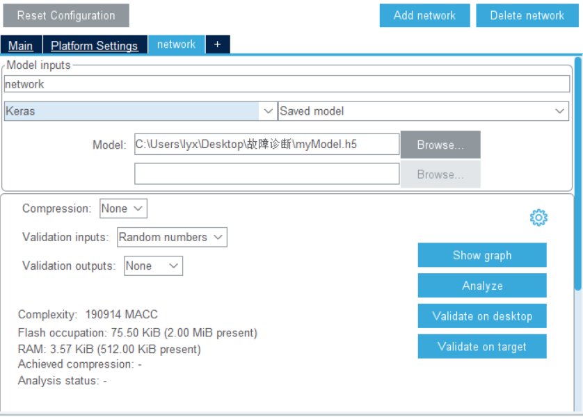

# 嵌入式移植的配置流程
## STM32嵌入式移植的流程
### 获取权重文件
- 通过keras搭建的神经网络可保存为.h5文件  
     `model.save('myModel.h5')`
- 通用型权重文件ONNX  
ONNX(Open Neural Network Exchange)，开放神经网络交换，用 于在各种深度学习训练和推理框架转换的一个中间表示格式。如使用pytorch生产ONNX格式可直接调用  
    `torch.onnx.export(model, input, output_name)`
### 通过cubeMX生成C权重文件
STM32基本配置（以STM32H743为例）
- 时钟树配置
    
- 串口配置  
    设置PA9和PA10引脚分别为UASRT1的RX和TX端，模式选择为异步通信，波特率选择为115200，其余配置选择默认即可。
    
- 网络模型配置和验证  
    在cubeMX中可下载X-CUBE-AI包进行网络模型配置，目前支持的模型有Keras、TFlite和ONNX。  
      
    选择好模型后点击*analyze*，验证通过后可选择*show graph*获取可视化的模型结构
    完成模型验证后，开启配置好的串口UASRT1用于传输神经网络的信息
    
- 生成代码
### C语言编程的重要API
- 输入和输出缓冲区被定义为具有最多 3 个维度的张量（HWC 布局格式，代表高度、宽度和通道）.  
```
typedef struct ai_buffer_ {
ai_buffer_format format; /*!< 缓冲区格式 */
ai_u16 n_batches; /*!< 缓冲区中的批数 */
ai_u16 height; /*!< 缓冲区高度维度 */
ai_u16 width; /*!< 缓冲区宽度维度 */
ai_u32 channels; /*!< 缓冲区通道编号 */
ai_handle data; /*!< 指向缓冲区数据的指针 */
 } ai_buffer;
```
- ai_init用于初始化实例化 NN 的内部运行时结构  
    `ai_bool ai_<name>_init(ai_handle network, const ai_network_params* params);`
- ai_run是馈送 NN 的主函数。输入和输出缓冲区参数（ai_buffer 类型）提供输入张量并存储预测的输出张量  
`ai_i32 ai_<name>_run(ai_handle network, const ai_buffer* input, ai_buffer* output);`  
## 英飞凌平台嵌入式移植的流程
### 获取权重文件  
通过keras搭建的神经网络可保存为.h5文件（目前nnom转换器暂不支持ONNX）
### 使用NNoM转换器将权重文件转换为C文件  
NNoM 是一个定点神经网络库，可以将训练的Keras模型直接转换成C文件。现在支持 8-bit定点格式，支持数十种操作，卷积，池化，激活，矩阵计算等。
- NNoM Utils  
NNoM Utils是用于部署模型的Python脚本。这些函数位于scripts/nnom_utils.py
     - 生成模型  
    `generate_model(model, x_test, name='weights.h', format='hwc', kld=True)`    
    该函数是部署中最常用的功能。它首先使用扫描每层输出的输出范围`layers_output_ranges()`然后量化并写入权重和偏差，使用融合BatchNorm参数`generate_weights()`.最后，生成C函数weights.  
        - model：经过训练的 Keras 模型
        - x_test：用于检查校准每层输出数据量化范围的数据集。**用NNom进行转换时需要提供测试集**
        - name：自动生成的c文件的名称。
        - format：表示后端格式，选项在'hwc'和之间'chw'。参见注释

### 英飞凌平台部署
- 导入NNom相关文件  
将生成的weights.h和其他相关文件(port,inc,src中的文件)导入至aurix development studio中。并将其中所有头文件添加路径到当前工程文件夹。
- c语言相关API
    - `nnom_model_t *new_model(nnom_model_t *m)`  
    用于创建或启动模型
    - `void model_delete(nnom_model_t *m)`  
    用于删除并释放使用模型创建的所有资源。
    - `nnom_status_t   model_run(nnom_model_t *m)`  
    运行模型内的所有层。
